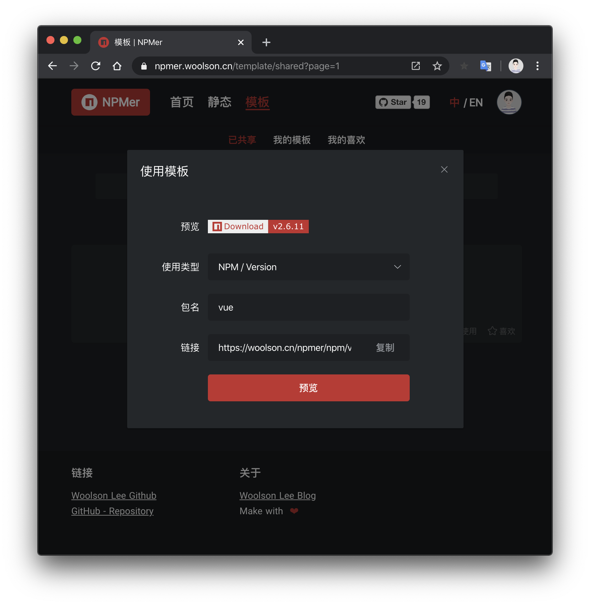

# 🐳 NPMer徽章制作

 


使用SVG制作NPM徽章，NPM badge made with SVG.


## Preview 预览

## Feature 特性

### Badge 徽章

* Build with svg **`svg`实现不失真；**
* Download badge file locally **支持下载徽章文件；**
* Generate online link **支持生成在线链接**；
* Customize left and right background color **支持左右自定义背景颜色**；
* Customize icon **支持自定义图标**；
* Customize icon position **支持自定义图标位置**；
* Customize icon color **支持自定义图标颜色**；
* Customize text color **支持自定义文字颜色**；

### Template 模板

* Generate online link **支持生成在线链接**；
* Customize left and right background color **支持左右自定义背景颜色**；
* Customize icon **支持自定义图标**；
* Customize icon position **支持自定义图标位置**；
* Customize icon color **支持自定义图标颜色**；
* Customize text color **支持自定义文字颜色**；

#### 模板动态数据

* NPM Info 信息：
  * Version 版本
  * Download 下载量
* GitHub Info 信息：
  * Star 点赞数
  * Release 发布版本
* 添加中...

